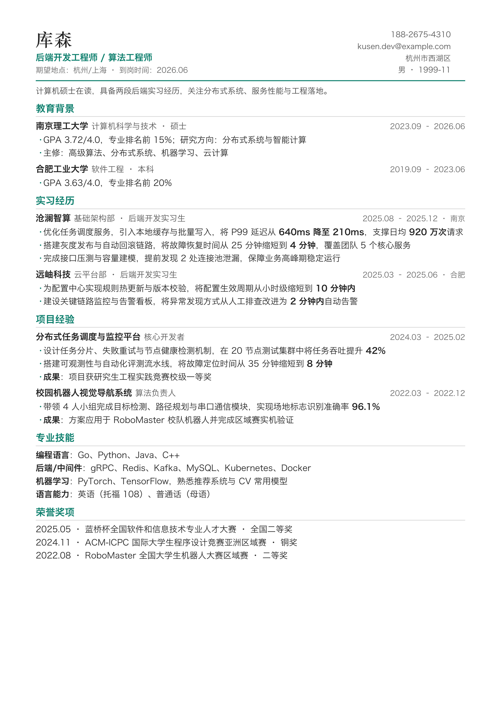

# resume-builder

English | [简体中文](README.md)

`resume-builder` is a Codex and Claude Code Skill for creating Chinese resumes.

It turns real experience into a polished resume, tailors content to a job description, and renders
one Markdown source into multiple searchable A4 PDF layouts.



All names, schools, companies, projects, awards, and figures in the preview are fictional examples.
School names are used only to demonstrate layout and do not imply any affiliation.

## Features

- Build resumes from conversation, Markdown, CSV, or xlsx
- Rewrite experience using STAR/XYZ and quantified outcomes
- Analyze matched and missing job-description keywords
- Adapt content for campus hiring, experienced hiring, and different roles
- Switch between five layouts and multiple accent colors
- Support optional photos while excluding sensitive identity data by default
- Generate offline, searchable A4 PDFs

## Installation

### Recommended Codex installation

Give the repository URL to Codex and ask it to install the complete Skill folder:

```text
Install the Codex Skill from this repository:
https://github.com/cosen1024/resume-builder-skill.git

Install the complete resume_skill folder as resume-builder.
Do not copy only SKILL.md. Preserve the agents, assets, references,
scripts, and evals directories.
```

The complete directory structure is required because rendering depends on bundled templates, CSS,
scripts, and writing references.

Start a new Codex session after installation.

### Manual Codex installation

```bash
git clone https://github.com/cosen1024/resume-builder-skill.git
cd resume-builder-skill

mkdir -p ~/.codex/skills
cp -R resume_skill ~/.codex/skills/resume-builder
```

To update later with `git pull`, keep the clone and use a symlink:

```bash
git clone https://github.com/cosen1024/resume-builder-skill.git
cd resume-builder-skill

mkdir -p ~/.codex/skills
ln -s "$(pwd)/resume_skill" ~/.codex/skills/resume-builder
```

### Claude Code installation

```bash
git clone https://github.com/cosen1024/resume-builder-skill.git
cd resume-builder-skill

mkdir -p ~/.claude/skills
cp -R resume_skill ~/.claude/skills/resume-builder
```

## Python dependencies

PDF output uses WeasyPrint:

```bash
python3 -m pip install -r requirements.txt
```

In these commands, `python3` means the interpreter where the dependencies are installed. Replace it
with the appropriate interpreter command for your virtual environment, Linux, macOS, or Windows setup.

## Usage

This Skill requires explicit invocation:

```text
Use $resume-builder to create a concise Chinese campus resume for a backend engineering role
from my real experience.
```

Other examples:

```text
Use $resume-builder to polish this resume without inventing experience or metrics.
```

```text
Use $resume-builder to tailor my resume to this job description and list matched and missing keywords.
```

```text
Use $resume-builder to render this resume with both the compact and classic templates.
```

## Templates

| Template | Style | Recommended use |
|---|---|---|
| `compact` | Dense, stable single column | Chinese technical roles and campus hiring |
| `classic` | Black-and-white, ATS oriented | Broad applications and conservative industries |
| `modern` | Colored sidebar | Internet, product, and operations roles |
| `timeline` | Chronological rail | Candidates with many internships or projects |
| `minimal` | Restrained whitespace | Short, carefully edited resumes |

Available accents:

```text
blue / teal / wine / ink / purple / green / orange / #rrggbb
```

`classic` always remains black and white.

## Render the bundled example

```bash
python3 \
  resume_skill/scripts/render.py \
  resume_skill/assets/resume.example.md \
  --template compact \
  --accent teal \
  --out resume.pdf
```

Convert CSV or xlsx to Markdown:

```bash
python3 \
  resume_skill/scripts/csv_to_md.py \
  resume_skill/assets/resume.example.csv \
  --out resume.md
```

## Skill structure

```text
resume_skill/
├── SKILL.md
├── agents/
│   └── openai.yaml
├── scripts/
│   ├── csv_to_md.py
│   └── render.py
├── references/
│   ├── field-schema.md
│   ├── role-presets.md
│   ├── templates-guide.md
│   ├── visual-design-system.md
│   └── writing-principles.md
├── assets/
│   ├── resume.example.csv
│   ├── resume.example.md
│   ├── styles/
│   └── templates/
└── evals/
    └── test_resume_skill.py
```

## Limitations

- Spreadsheet import supports `.csv` and `.xlsx`, but not legacy `.xls`
- Markdown parsing is limited to the headings, entries, and inline syntax documented by this project
- Current output formats are HTML and PDF; DOCX export and a web editor are not included
- JD matching and rewriting are performed by the model invoking the Skill, not by a standalone scorer

## Tests

```bash
python3 -m unittest \
  resume_skill/evals/test_resume_skill.py -v
```

## License

[PolyForm Noncommercial License 1.0.0](LICENSE)

Personal study, research, education, and other noncommercial uses are permitted. Commercial use
requires separate permission from the author. Because commercial use is restricted, this project is
source-available rather than Open Source Initiative approved open source.
