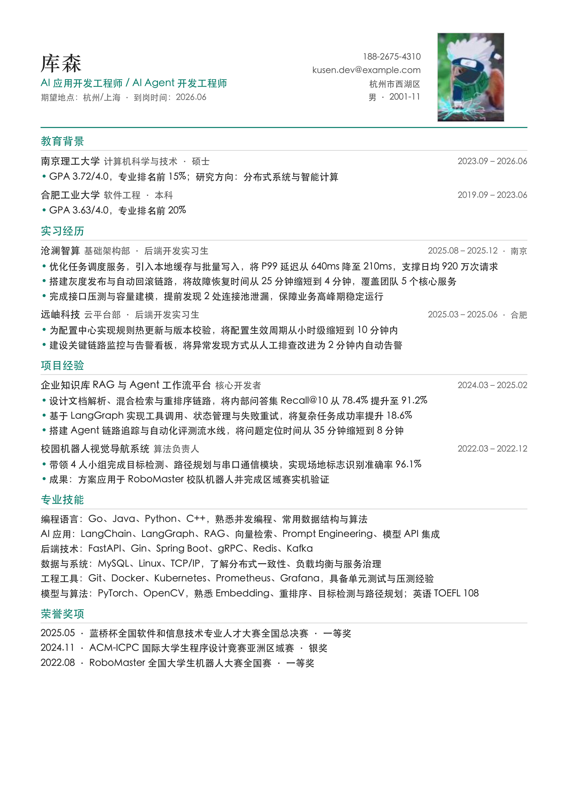
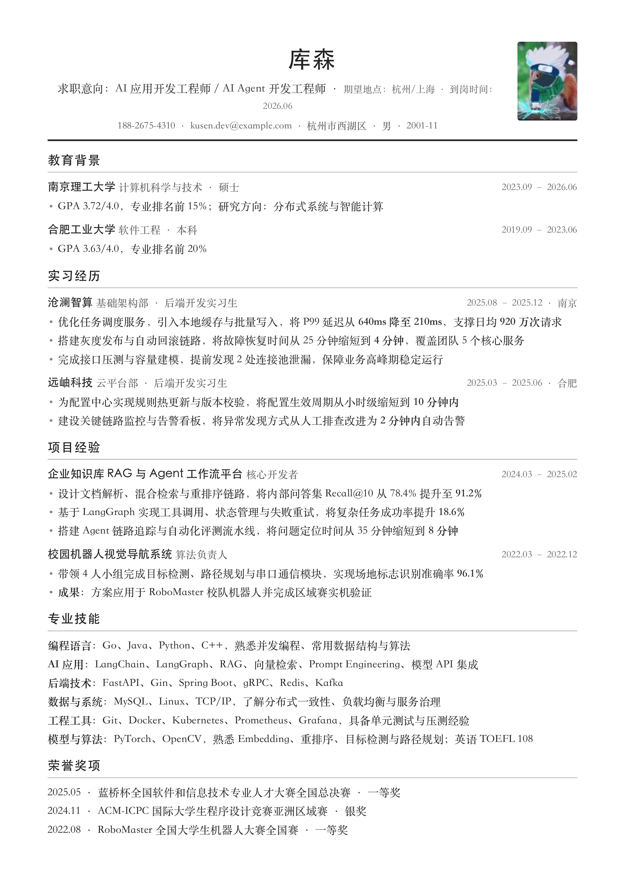
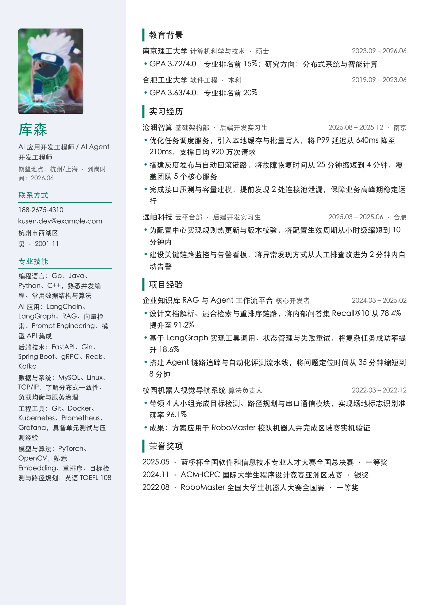
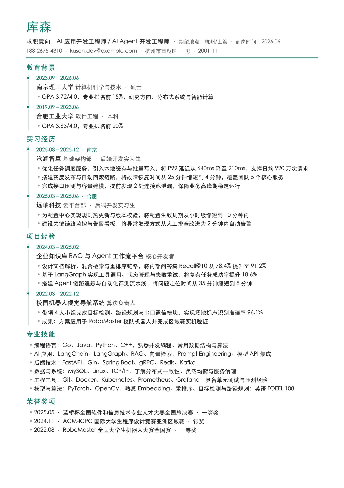
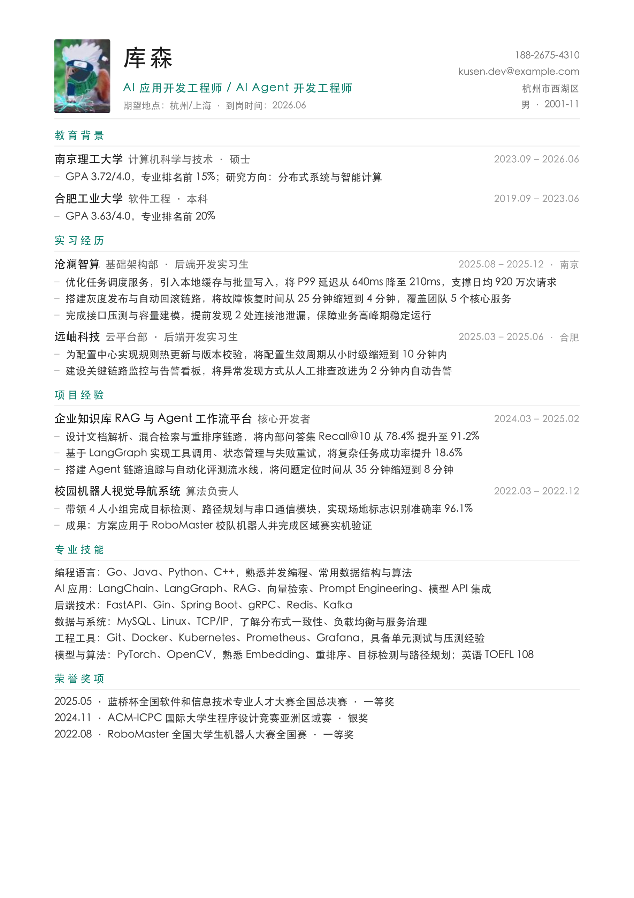

<div align="center">

# resume-builder

### 从真实经历到可直接投递的专业简历

适用于 Codex、Claude Code 和其他可读取 `SKILL.md`、运行本地脚本的 AI Agent。<br>
中文排版优化，同时支持英文与中英双语简历。

<p>
  
  
  
  
  
</p>

**内容采集 · STAR/XYZ 润色 · JD 匹配 · 多模板排版 · 离线 PDF 导出**

[English](README.en.md) · [核心特色](#-核心特色) · [模板效果](#-模板效果) ·
[安装](#-安装) · [使用](#-使用) · [License](#-license)

</div>

---

## ✨ 核心特色

- **从经历到成品**：对话采集、内容润色、模板排版和 PDF 导出形成完整工作流
- **真实信息优先**：通过追问补充背景、行动和结果，不擅自编造经历或数字
- **STAR / XYZ 润色**：把职责描述改写为有行动、有规模、有结果的简历要点
- **JD 定向匹配**：提取岗位关键词，分析命中项与缺失项，并调整内容顺序和表达
- **多场景适配**：支持校招、社招，以及 AI Agent、后端、算法、前端、产品、运营等岗位侧重
- **多种输入方式**：支持对话、Markdown、CSV 和 xlsx
- **5 套专业模板**：`compact`、`classic`、`modern`、`timeline`、`minimal`
- **照片与配色可选**：4 套模板支持头像，提供 7 种预设配色和自定义色值
- **离线稳定渲染**：不依赖 CDN、远程字体或在线简历网站，PDF 文本可搜索、可复制
- **隐私默认收敛**：身份证号等敏感字段默认不进入简历正文

## 🖼️ 模板效果

| `compact` · 紧凑单栏 | `classic` · 黑白 ATS |
|---|---|
| <a href="preview/resume-compact.png"></a> | <a href="preview/resume-classic.png"></a> |

| `modern` · 彩色侧栏 | `timeline` · 时间线 |
|---|---|
| <a href="preview/resume-modern.png"></a> | <a href="preview/resume-timeline.png"></a> |

| `minimal` · 极简留白 |
|---|
| <a href="preview/resume-minimal.png"></a> |

预览中的姓名、学校、公司、项目、奖项和数字均为虚构示例，不代表任何真实关联。
头像用于展示可选照片布局；删除 `photo` 字段即可生成无头像版本。点击图片可查看高清原图。

## 📦 安装

### 推荐：让 AI Agent 安装

把仓库地址和下面的提示词交给支持 Skill 的 Agent：

```text
请从这个仓库安装 resume-builder：
https://github.com/cosen1024/resume-builder-skill.git

请安装完整的 resume_skill 文件夹，不要只复制 SKILL.md。
运行时请保留 assets、references 和 scripts 目录。
```

`SKILL.md`、`assets/`、`references/` 和 `scripts/` 是运行核心，安装时请保持它们的目录结构。

### 手动安装到 Codex

```bash
git clone https://github.com/cosen1024/resume-builder-skill.git
cd resume-builder-skill
mkdir -p ~/.codex/skills
cp -R resume_skill ~/.codex/skills/resume-builder
```

### 手动安装到 Claude Code

```bash
git clone https://github.com/cosen1024/resume-builder-skill.git
cd resume-builder-skill
mkdir -p ~/.claude/skills
cp -R resume_skill ~/.claude/skills/resume-builder
```

### 其他 AI Agent

将完整的 `resume_skill/` 复制到对应 Agent 的 Skill 目录；如果该 Agent 没有固定 Skill
目录，则让它读取 `resume_skill/SKILL.md`，并允许其调用 `scripts/` 中的本地命令。
不要拆散 `assets/` 和 `references/`。

## 🐍 Python 依赖

需要 **Python 3.10 或更高版本**。PDF 默认由 WeasyPrint 生成：

```bash
python3 -m pip install -r requirements.txt
```

`python3` 代表安装了这些依赖的解释器。虚拟环境、Linux、macOS 或 Windows 用户应替换为
自己的解释器命令。`requirements.txt` 使用经过测试的主版本范围，避免自动升级到不兼容版本。

### WeasyPrint 无法启动时

脚本会区分两类错误：

- Python 包未安装：按提示重新安装 `requirements.txt`
- WeasyPrint 已安装但系统图形库加载失败：根据
  [WeasyPrint 安装文档](https://doc.courtbouillon.org/weasyprint/stable/first_steps.html#installation)
  补齐系统依赖

暂时无法修复系统库时，可以先生成模板专属 HTML：

```bash
python3 resume_skill/scripts/render.py resume.md \
  --template compact \
  --html-only
```

输出文件为 `resume.compact.html`。使用 Chrome、Edge 或 Safari 打开后打印为 A4 PDF，
并启用“背景图形”。浏览器打印可作为应急方案，但分页可能与 WeasyPrint 略有差异。

## 🚀 使用

安装后，直接自然描述任务即可，不需要特殊符号：

```text
请使用 resume-builder，根据我的真实经历生成一份 AI Agent 开发校招简历。
```

```text
请使用 resume-builder，润色这份英文简历，保留真实信息，不要编造数字。
```

```text
请使用 resume-builder，根据这份 JD 调整我的简历，并列出命中和缺失的关键词。
```

```text
请使用 resume-builder，把这份简历渲染成 compact 和 classic 两个版本。
```

## 🎨 模板

| 模板 | 风格 | 推荐场景 | 照片 |
|---|---|---|---|
| `compact` | 紧凑单栏、稳定清晰 | 技术岗、校招、内容较多 | 支持 |
| `classic` | 黑白单栏、ATS 优先 | 海投、国企、银行、保守行业 | 支持 |
| `modern` | 彩色侧栏 | 互联网、产品、运营岗位 | 支持 |
| `timeline` | 时间线布局 | 实习或项目经历较多 | 不显示 |
| `minimal` | 极简留白 | 内容精炼、偏设计感 | 支持 |

可用配色：

```text
blue / teal / wine / ink / purple / green / orange / #rrggbb
```

`classic` 始终保持黑白。

## ✅ 快速验证安装

下面的命令只用于确认依赖、模板和 PDF 渲染链路可用：

```bash
python3 resume_skill/scripts/render.py \
  resume_skill/assets/resume.example.md \
  --template compact \
  --accent teal \
  --out resume.pdf
```

正式使用时，应让 Agent 根据你的真实材料生成或修改 `resume.md`，再调用同一渲染脚本。

## 🗂️ Skill 目录

```text
resume_skill/
├── SKILL.md                         # Agent 工作流与调用规则
├── scripts/
│   ├── csv_to_md.py                 # CSV/xlsx 转 Markdown
│   └── render.py                    # Markdown 渲染 HTML/PDF
├── references/
│   ├── field-schema.md              # 数据格式与字段映射
│   ├── role-presets.md              # 不同岗位的内容侧重
│   ├── templates-guide.md           # 模板、配色和照片选择
│   ├── visual-design-system.md      # 字体、尺寸与版式规范
│   └── writing-principles.md        # STAR、量化与 ATS 写作规范
├── assets/
│   ├── resume.example.csv           # 虚构表格示例
│   ├── resume.example.md            # 虚构 Markdown 示例
│   ├── examples/demo-avatar.png     # 照片排版示例
│   ├── styles/resume-base.css       # 公共打印样式
│   └── templates/                   # 五套 HTML/CSS 模板
│       ├── compact/
│       ├── classic/
│       ├── modern/
│       ├── timeline/
│       └── minimal/
```

## 🧭 能力边界

- 表格导入支持 `.csv` 和 `.xlsx`，不支持旧版 `.xls`
- Markdown 只解析本项目约定的标题、条目和简单行内格式
- 当前输出格式为 HTML 和 PDF，不提供 DOCX 导出或网页编辑器
- JD 匹配与内容润色由调用 Skill 的 Agent 完成，不是独立评分服务
- 当前未内置 Playwright/Chromium 后端；WeasyPrint 不可用时可通过 HTML 使用浏览器打印

## 🧪 测试

```bash
python3 -m unittest resume_skill/evals/test_resume_skill.py -v
```

## ⚖️ License

[PolyForm Noncommercial License 1.0.0](LICENSE)

允许个人学习、研究、教育及其他非商业用途。商业使用需要获得作者的单独授权。
由于该许可证限制商业用途，本项目属于“源码可用（source-available）”，不属于 OSI 定义下的开源软件。
