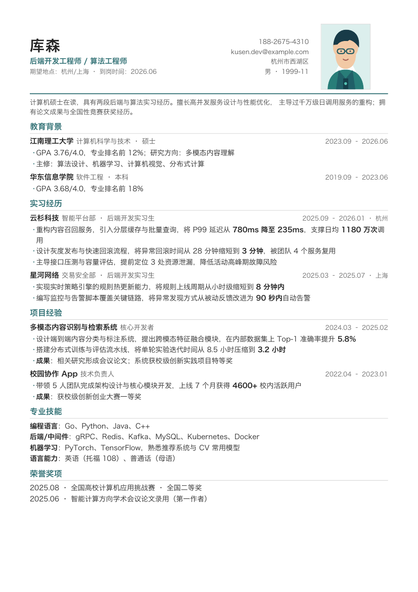

# resume-builder

[English](README.en.md) | 简体中文

`resume-builder` 是一个面向中文求职场景的 Codex / Claude Code Skill。

它可以根据真实经历生成或润色简历，按目标岗位 JD 调整内容，并将同一份 Markdown
内容渲染成多种 A4 PDF 模板。



## 功能

- 根据对话、Markdown、CSV 或 xlsx 整理简历
- 使用 STAR / XYZ 和量化结果润色经历
- 分析 JD 的命中关键词与缺失项
- 支持校招、社招及不同岗位的内容侧重
- 提供 5 套可切换模板和多种配色
- 支持可选照片，默认不输出身份证号等敏感字段
- 离线生成可复制、可搜索的 A4 PDF

## 安装

### Codex 推荐安装方式

最简单的方式是把仓库地址交给 Codex，让它安装完整的 Skill 文件夹：

```text
请从这个仓库安装 Codex Skill：
https://github.com/cosen1024/resume-builder-skill.git

请把完整的 resume_skill 文件夹安装为 resume-builder，
不要只复制 SKILL.md。请保留其中的 agents、assets、references、
scripts 和 evals 目录。
```

关键规则：必须保留完整目录结构。模板、CSS、脚本和写作规范都在 `resume_skill/`
内部，只复制 `SKILL.md` 无法正常生成 PDF。

安装完成后，请开启一个新的 Codex 会话。

### 手动安装到 Codex

```bash
git clone https://github.com/cosen1024/resume-builder-skill.git
cd resume-builder-skill

mkdir -p ~/.codex/skills
cp -R resume_skill ~/.codex/skills/resume-builder
```

如果你希望后续通过 `git pull` 更新，可以保留仓库 clone 并创建软链接：

```bash
git clone https://github.com/cosen1024/resume-builder-skill.git
cd resume-builder-skill

mkdir -p ~/.codex/skills
ln -s "$(pwd)/resume_skill" ~/.codex/skills/resume-builder
```

### 安装到 Claude Code

```bash
git clone https://github.com/cosen1024/resume-builder-skill.git
cd resume-builder-skill

mkdir -p ~/.claude/skills
cp -R resume_skill ~/.claude/skills/resume-builder
```

## Python 依赖

PDF 由 WeasyPrint 生成。安装依赖：

```bash
python3 -m pip install -r requirements.txt
```

命令中的 `python3` 代表安装了上述依赖的 Python 解释器。使用虚拟环境、Linux、macOS
或 Windows 时，请按实际环境替换为对应的解释器命令。

## 使用

本 Skill 默认需要明确调用：

```text
使用 $resume-builder，根据我的真实经历生成一份后端开发校招简历。
```

也可以直接提供已有材料：

```text
使用 $resume-builder，润色这份简历，保留真实信息，不要编造数字。
```

```text
使用 $resume-builder，根据这份 JD 调整我的简历，并列出命中和缺失的关键词。
```

```text
使用 $resume-builder，把这份简历渲染成 compact 和 classic 两个版本。
```

## 模板

| 模板 | 风格 | 推荐场景 |
|---|---|---|
| `compact` | 紧凑单栏、稳定清晰 | 中文技术岗、校招、内容较多 |
| `classic` | 黑白单栏、ATS 优先 | 海投、国企、银行、保守行业 |
| `modern` | 彩色侧栏 | 互联网、产品、运营岗位 |
| `timeline` | 时间线布局 | 实习或项目经历较多 |
| `minimal` | 极简留白 | 内容精炼、偏设计感 |

可用配色：

```text
blue / teal / wine / ink / purple / green / orange / #rrggbb
```

`classic` 始终保持黑白。

## 直接渲染示例

```bash
python3 \
  resume_skill/scripts/render.py \
  resume_skill/assets/resume.example.md \
  --template compact \
  --accent teal \
  --out resume.pdf
```

CSV 或 xlsx 可以先转换成 Markdown：

```bash
python3 \
  resume_skill/scripts/csv_to_md.py \
  resume_skill/assets/resume.example.csv \
  --out resume.md
```

## Skill 目录

```text
resume_skill/
├── SKILL.md
├── agents/
│   └── openai.yaml
├── scripts/
│   ├── csv_to_md.py
│   └── render.py
├── references/
│   ├── field-schema.md
│   ├── role-presets.md
│   ├── templates-guide.md
│   ├── visual-design-system.md
│   └── writing-principles.md
├── assets/
│   ├── resume.example.csv
│   ├── resume.example.md
│   ├── examples/
│   ├── styles/
│   └── templates/
└── evals/
    └── test_resume_skill.py
```

## 能力边界

- 表格导入支持 `.csv` 和 `.xlsx`，不支持旧版 `.xls`
- Markdown 只解析本项目约定的标题、条目和简单行内格式
- 当前输出格式为 HTML 和 PDF，不提供 DOCX 导出或网页编辑器
- JD 匹配与内容润色由调用 Skill 的模型完成，不是独立评分服务

## 测试

```bash
python3 -m unittest \
  resume_skill/evals/test_resume_skill.py -v
```

## License

[MIT](LICENSE)
